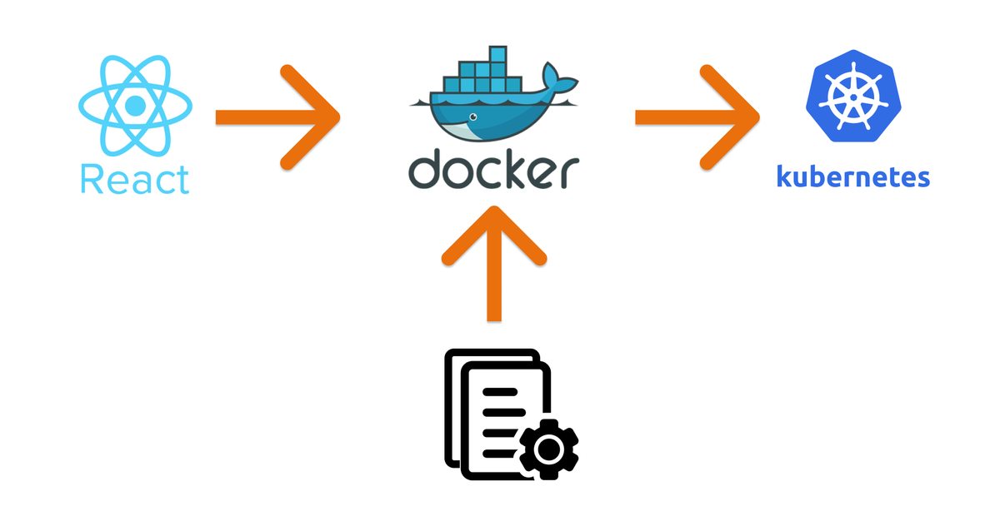

# 📍 React-Docker-K8S
A small proof of concept with React, Docker, and Minikube that  involve creating a simple React application, dockerizing it, and deploying it on a local Kubernetes cluster using Minikube.
<p align="center">

</p>

### Summary

1. Set up a basic React application using create-react-app or a similar tool.

2. Create a Dockerfile to containerize the React application, defining the environment and dependencies needed to run the app within a Docker container.

3. Build a Docker image for the React app using the Dockerfile and run the container locally to ensure it works as expected.

4. Install Minikube, a tool for running a single-node Kubernetes cluster locally, and start the Minikube cluster.

5. Create Kubernetes deployment and service configuration files to deploy the Dockerized React app within the Minikube cluster.

6. Deploy the Dockerized React app to the Minikube cluster using the kubectl command-line tool.

# POC Summary: React, Docker, and Minikube

1. [Creating a New React App](#create-react-app)
2. [Creating the Dockerfile](#create-dockerfile)
3. [Building and Pushing the Docker Image](#build-push-docker-image)
4. [Installing and Starting Minikube](#install-start-minikube)
5. [Creating the YAML File for Deployment](#create-yaml-file)
6. [Applying the Deployment and Service](#apply-deployment-service)

---

##  <span id="create-react-app">1- Creating a New React App</span>
To create a new React app, use the following commands:

````bash
npx create-react-app [your_app_name]
````

After setting up the app, check if everything works as expected.

````bash
npm start 
````

## <span id="create-dockerfile">2- Creating the Dockerfile</span>
Now after setting up our app we will go straight to the point, we will create ower docker file

Create a Dockerfile to containerize the React application.for owr exemple we will create a minimal configuration to showcase the process.

Within your project create a Dockerfile :

```docker
FROM node:18.20.2-alpine
WORKDIR /app
COPY package.json .
RUN npm install
COPY . .
CMD [ "npm","start" ]
````

As I said, it's a small example just to showcase how we can do things, here i chosed **node: 18.20.2-alpine** as a default image but you can chose ngnix or anything else that feels your needs.

## <span id="build-push-docker-image">3- Building and Pushing the Docker Image</span> 

After creating owr dockerfile we will build the image : 

Build the Docker image:
```bash
docker build -t [my_docker_id]/react-docker-kub .
```
Push the image to Docker Hub:
```bash
docker push [my_docker_id]/react-docker-kub
```
Here, **react-docker-kub** is the name of owr application.


## <span id="install-start-minikube">4- Installing and Starting Minikube</span> 
Before creating the YAML file for deployment, install Minikube. Minikube is a tool that lets you run a single-node Kubernetes cluster locally.

For Windows, you can install Minikube using:

Installation (Windows):
```bash
winget install Kubernetes.minikube
```
For Linux and macOS installation options, refer to the Minikube documentation. [Minikube documentation.](https://minikube.sigs.k8s.io/docs/start/?arch=%2Fwindows%2Fx86-64%2Fstable%2F.exe+download) 

After installing Minikube, start the cluster to ensure that everything is working fine:

Start Minikube:
```bash
minikube start
```

## <span id="create-yaml-file">5- Creating the YAML File for Deployment</span> 
In this step, we will create the YAML file to deploy the Dockerized React app within the Minikube cluster.

This section is about creating the configuration files for Kubernetes deployment and service.

````yaml
apiVersion: apps/v1
kind: Deployment
metadata:
  name: react-docker-kub-deployment
spec:
  selector:
    matchLabels:
      app: react-app
  replicas: 1
  template:
    metadata:
      labels:
        app: react-app
    spec:
      containers:
      - name: react-app
        image: [my-docker-id]/react-docker-kub
---
apiVersion: v1
kind: Service
metadata:
  name: react-docker-kub-service
spec:
  type: NodePort
  selector:
    app: react-app
  ports:
  - name: my-app
    port: 3000
    targetPort: 3000
````


## <span id="apply-deployment-service">6- Applying the Deployment and Service</span> 
Finnally, now we will apply and we will create the deployment and the service using : 
```bash
kubectl apply -f react-docker-kub-depl.yaml
```
Note: don't forget to get into the folder that you created in owr case (infra) ! 

if everything is good you can check the status of the pods:
```bash
kubectl get pods
```
And also check the status of services:
```bash
kubectl get services
```
And if you did everything good you will be able to see the service that you created ! 

Final step, check if your Minikube is running , otherwise open a new terminal and run : 
```bash
minikube start
```

To see the services list , and between them you will find owr service 'react-docker-kub-service' run: 
```bash
minikube service list
```
To get the url run : 
```bash
minikube service my-react-app-service  --url 
```
Where [**my-react-app-service**] is the name of owr service in owr YAML file

---
Tada ✨✨✨ , copy the url , paste it on your favorite navigator and see the magic , for more details about your pod and the config that we did and if you love the metrics you can run : 
```bash
minikube dashboard 
```


## Conclusion
By following these steps, you have created a POC demonstrating the development, containerization, and deployment of a React application using Docker, and Minikube. You can now apply these concepts to real Kubernetes clusters on platforms like Amazon, Azure, RedHat, and more.


## 🙇 Reference and documentation

- React & Docker & K8S
  - [create-react-app documentation](https://create-react-app.dev/docs/getting-started/).
  - [Dockerfile documentation](https://docs.docker.com/reference/dockerfile/).  
  - [Docker build commands](https://docs.docker.com/reference/cli/docker/buildx/build/).
  - [Minikube documentation](https://minikube.sigs.k8s.io/docs/start/?arch=%2Fwindows%2Fx86-64%2Fstable%2F.exe+download).
  - [Kubernetes documentation](https://kubernetes.io/docs/home/).